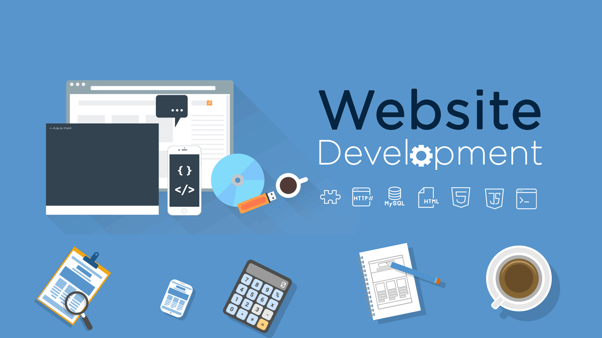

  

  

  

<table width="100%" border="0" cellspacing="0" cellpadding="0" style="border-collapse: collapse;">
  <tr>
    <td align="center">
      <h2><code>🏢 About Us</code></h2>
      

        <b>Lumina Studio Ltda</b> is a software development powerhouse founded by <b>5 partners</b> obsessed with technical excellence. We bridge the gap between <b>high-end web architecture</b> and <b>next-gen immersive gaming</b>.
      

    </td>
  </tr>
</table>

  <h2><code>🚀 Services & Expertise</code></h2>

<table width="100%" border="0" style="border-collapse: collapse; margin: 20px 0;">
  <tr>
    <td width="5%" align="center"></td>
    <td width="45%" align="left" valign="top">
      <h3>Web Development</h3>
      
<code>• High-End Landing Pages</code>

      
<code>• Scalable Web Systems</code>

      
<code>• Custom API Integrations</code>

      
<code>• Next-Gen Infrastructure</code>

    </td>
    <td width="5%" align="center"></td>
    <td width="45%" align="left" valign="top">
      <h3>Roblox Development</h3>
      
<code>• Premium UI / UX Design</code>

      
<code>• Advanced Luau Scripting</code>

      
<code>• Game Design & Mechanics</code>

      
<code>• Live Ops & Updates</code>

    </td>
  </tr>
</table>

  <h2><code>📊 Performance & Ecosystem</code></h2>

<table width="100%" border="0" style="border-collapse: collapse;">
  <tr>
    <td width="50%" align="center"></td>
    <td width="50%" align="center"></td>
  </tr>
  <tr>
    <td colspan="2" align="center" style="padding-top: 10px;">
      
    </td>
  </tr>
</table>

  <h2><code>🛠️ Tech Stack</code></h2>
  
  
<b>Frontend & Design</b>

  

    
    
    
    
  

  
<b>Backend & Cloud</b>

  

    
    
    
    
    
    
  

  
<b>Game Engine</b>

  

    
    
  

  <h2><code>📬 Connect With Our Founders</code></h2>
  
<b>Have a vision? We have the light. Let's build something extraordinary.</b>

   
  
  
  
  
  
    
  

